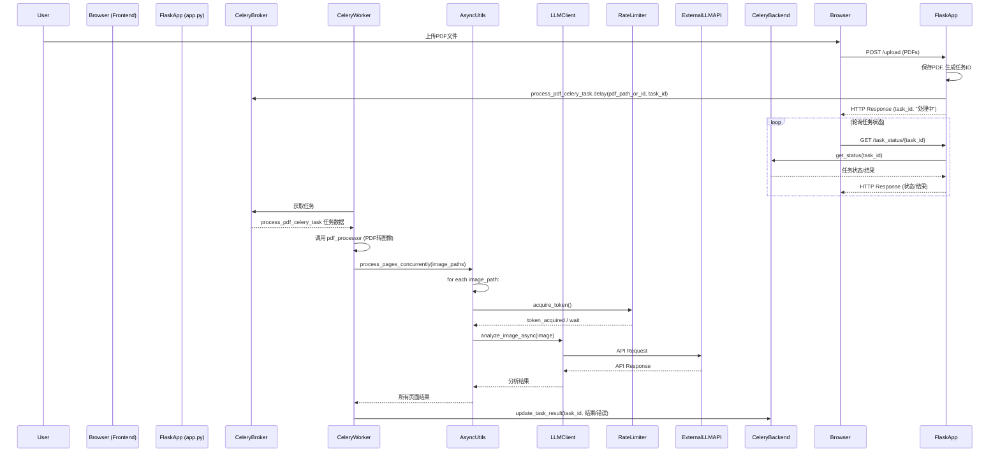

# One_OCR 异步处理与响应优化架构设计

本文档详细描述了 "One_OCR" 项目为实现异步处理和响应优化功能所设计的系统架构。该设计基于 `spec-pseudocode` 模式提供的规格说明和伪代码。

## 1. 架构总览

为了提高用户体验和系统吞吐量，特别是处理多个PDF文件或单个PDF内大量页面时，引入了异步处理机制。核心组件包括 Flask 应用、Celery 分布式任务队列、以及用于页面级并发的 `asyncio`。

### 1.1. 系统组件图 (Mermaid)

```mermaid
graph TD
    subgraph User Interaction
        UI_HTML[/"templates/index.html (用户上传PDF)"/]
        UI_RESULTS[/"templates/results.html (显示状态/结果)"/]
    end

    subgraph Flask Application (app.py)
        direction LR
        FLASK_ROUTES[/"Flask Routes (@app.route)"/]
        FLASK_UPLOAD_HANDLER["处理上传 (save PDF, create task ID)"]
        FLASK_STATUS_ENDPOINT["/task_status/<task_id> (查询Celery Backend)"]
        FLASK_CELERY_CLIENT["Celery Client (send_task)"]
    end

    subgraph Celery Distributed Task Queue
        direction LR
        CELERY_BROKER[("Message Broker (Redis/RabbitMQ)")]
        CELERY_WORKER[/"Celery Worker(s) (celery_app.py)"/]
        CELERY_BACKEND[("Result Backend (Redis)")]
    end

    subgraph Processing Logic
        PDF_PROCESSOR_MOD["pdf_processor.py (PDF to Images)"]
        ASYNC_UTILS_MOD["async_utils.py (Async Page Processing w/ asyncio)"]
        LLM_CLIENTS_MOD["gemini_client.py / openai_client.py (Async LLM Calls)"]
        RATE_LIMITER_MOD["rate_limiter.py (Token Bucket)"]
    end

    subgraph External Services
        LLM_API[("External LLM API (Gemini/OpenAI)")]
    end

    UI_HTML -- HTTP Request (Upload) --> FLASK_ROUTES
    FLASK_ROUTES -- "触发" --> FLASK_UPLOAD_HANDLER
    FLASK_UPLOAD_HANDLER -- "保存PDF, 生成Task ID" --> FLASK_CELERY_CLIENT
    FLASK_CELERY_CLIENT -- "task.delay()" --> CELERY_BROKER
    UI_HTML -- "返回Task ID" --> UI_RESULTS
    UI_RESULTS -- "轮询 /task_status/<task_id>" --> FLASK_STATUS_ENDPOINT
    FLASK_STATUS_ENDPOINT -- "查询任务" --> CELERY_BACKEND

    CELERY_WORKER -- "获取任务" --> CELERY_BROKER
    CELERY_WORKER -- "执行任务" --> PDF_PROCESSOR_MOD
    CELERY_WORKER -- "执行任务" --> ASYNC_UTILS_MOD
    ASYNC_UTILS_MOD -- "调用" --> LLM_CLIENTS_MOD
    LLM_CLIENTS_MOD -- "调用前检查" --> RATE_LIMITER_MOD
    LLM_CLIENTS_MOD -- "API请求" --> LLM_API
    LLM_API -- "API响应" --> LLM_CLIENTS_MOD
    LLM_CLIENTS_MOD -- "结果" --> ASYNC_UTILS_MOD
    ASYNC_UTILS_MOD -- "结果" --> CELERY_WORKER
    CELERY_WORKER -- "存储结果/状态" --> CELERY_BACKEND
```

## 2. 详细设计方案

### 2.1. `asyncio` 与 Flask 集成

*   **单个PDF内页面并发处理：**
    *   在 Celery 任务执行的上下文中（即在 Celery worker 内部），将使用 `asyncio` 来并发处理单个 PDF 文件内的所有页面。
    *   一个新的模块 `async_utils.py` (或集成到 `pdf_processor.py`) 将包含一个函数，例如 `process_pdf_pages_concurrently(image_paths, llm_client_config, rate_limiter_instance)`。
    *   此函数将为每个页面图像创建一个 `asyncio` 任务，这些任务通过异步 HTTP 客户端（如 `aiohttp`，集成到 LLM 客户端的异步方法中）调用 LLM API。
    *   使用 `asyncio.gather` 来并发执行这些页面处理任务。
*   **Flask 本身：** 核心 Flask 应用 ([`app.py`](app.py:1)) 保持其 WSGI 同步特性，不直接运行 `asyncio` 事件循环来处理 HTTP 请求。耗时操作将卸载到 Celery。

### 2.2. Celery 集成

*   **目的：** 处理多个PDF文件或单个大型PDF的整体处理流程，实现后台任务执行，允许即时用户响应。
*   **组件：**
    *   **Celery 应用实例 (`celery_app.py` 或 `tasks.py`)：**
        *   初始化 Celery app (`Celery(...)`)。
        *   配置 Broker URL (例如，`redis://localhost:6379/0`) 和 Result Backend URL (例如，`redis://localhost:6379/0`)。建议使用 Redis 同时作为 Broker 和 Backend 以简化部署，或 RabbitMQ 作为更专业的 Broker。
        *   定义 Celery 任务，例如 `@celery_app.task def process_pdf_celery_task(pdf_file_id, original_filename)`。
    *   **Celery Worker：**
        *   独立的进程，通过 `celery -A celery_app worker -l info` (或类似命令) 启动。
        *   从 Broker 获取任务并执行。
    *   **Flask 应用交互 ([`app.py`](app.py:1))：**
        *   当用户上传 PDF 后，[`app.py`](app.py:1) 将 PDF 文件保存到共享存储（确保 Celery worker 可以访问）。
        *   然后，[`app.py`](app.py:1) 调用 `process_pdf_celery_task.delay(pdf_file_id, original_filename)` 将任务提交到 Celery 队列。
        *   [`app.py`](app.py:1) 立即返回一个任务 ID 给用户。
*   **任务定义 (`process_pdf_celery_task`)：**
    1.  根据 `pdf_file_id` 获取 PDF 文件。
    2.  调用 [`pdf_processor.py`](pdf_processor.py:1) 将 PDF 转换为一系列页面图像。
    3.  调用 `async_utils.process_pdf_pages_concurrently()` 处理这些图像，获取所有页面的分析结果。
    4.  将聚合结果（或错误信息）存储到 Celery Result Backend。

### 2.3. 速率限制器 (令牌桶算法)

*   **目的：** 控制对外部 LLM API 的调用频率，防止超出服务限制。
*   **实现 (`rate_limiter.py`)：**
    *   创建一个 `TokenBucketRateLimiter` 类。
    *   构造函数接受 `tokens_per_second` (令牌生成速率) 和 `max_tokens` (桶容量)。
    *   提供一个 `consume(tokens_to_consume)` 方法：
        *   如果桶中令牌足够，则消耗令牌并立即返回 `True`。
        *   如果令牌不足，则可以阻塞等待，或立即返回 `False`，或引发特定异常，具体行为可配置或由调用方决定。对于异步上下文，应使用异步等待。
*   **集成点：**
    *   LLM 客户端 ([`gemini_client.py`](gemini_client.py:1), [`openai_client.py`](openai_client.py:1)) 在其实例化时，可以创建一个速率限制器实例（或接收一个共享实例）。
    *   在每次实际调用外部 LLM API 之前，LLM 客户端的（异步）方法会调用速率限制器的 `consume()` 方法。
    *   `async_utils.py` 在协调多个页面的 LLM 调用时，会确保通过 LLM 客户端间接使用速率限制。

### 2.4. 错误处理和任务状态反馈

*   **Celery 任务层面：**
    *   **状态：** Celery 自动跟踪任务状态 (PENDING, STARTED, SUCCESS, FAILURE, RETRY)。这些状态存储在 Result Backend。
    *   **错误捕获：** 在 `process_pdf_celery_task` 内部，所有关键步骤（PDF转换、页面处理、LLM调用）都应包含 `try-except`块。
    *   **错误存储：** 如果发生错误，详细的错误信息（类型、消息、堆栈跟踪摘要）应作为任务结果的一部分存储在 Result Backend。Celery 任务可以引发异常，这些异常也会被 Celery 捕获并标记任务为 FAILURE。
*   **`asyncio` 页面处理层面：**
    *   在 `async_utils.process_pdf_pages_concurrently` 中，每个页面的异步 LLM 调用也应有错误处理。
    *   单个页面的失败不应导致整个PDF处理任务的崩溃，除非是关键性错误。应记录页面级错误，并尝试处理其他页面。
    *   最终结果应包含成功处理的页面数据和失败页面的错误信息。
*   **Flask 应用与前端交互：**
    *   [`app.py`](app.py:1) 提供一个 API 端点，例如 `/task_status/<task_id>`。
    *   前端 ([`templates/results.html`](templates/results.html:1) 或专用状态页面) 使用 JavaScript 定期轮询此端点。
    *   `/task_status` 端点从 Celery Result Backend 查询任务状态和结果。
        *   如果任务成功，返回处理结果。
        *   如果任务失败，返回错误信息。
        *   如果任务正在进行，返回进度信息（如果可用，例如已处理页面数）。
    *   前端根据响应更新 UI。

## 3. 组件和模块

### 3.1. 新增模块/组件

*   **`celery_app.py` (或 `tasks.py`)**
    *   **职责：** 定义 Celery 应用实例、配置 Broker 和 Backend、定义 Celery 任务 (如 `process_pdf_celery_task`)。
    *   **交互：** [`app.py`](app.py:1) 导入并调用任务；Celery workers 执行此文件中的任务。
*   **`async_utils.py`**
    *   **职责：** 实现使用 `asyncio` 和异步 HTTP 客户端并发处理单个 PDF 内的多个页面。核心函数如 `process_pdf_pages_concurrently()`。
    *   **交互：** 被 `process_pdf_celery_task` 调用。与 LLM 客户端 ([`gemini_client.py`](gemini_client.py:1), [`openai_client.py`](openai_client.py:1)) 的异步接口交互，并使用 `rate_limiter.py`。
*   **`rate_limiter.py`**
    *   **职责：** 实现令牌桶算法 (`TokenBucketRateLimiter` 类) 进行 API 调用速率控制。
    *   **交互：** 被 LLM 客户端 ([`gemini_client.py`](gemini_client.py:1), [`openai_client.py`](openai_client.py:1)) 在调用外部 API 前使用。

### 3.2. 修改的现有模块

*   **[`app.py`](app.py:1) (Flask 应用)**
    *   **修改：**
        *   集成 Celery 客户端：将 PDF 处理任务提交到 Celery 队列。
        *   添加 `/task_status/<task_id>` API 端点。
        *   调整上传和结果显示逻辑以适应异步处理。
*   **[`pdf_processor.py`](pdf_processor.py:1)**
    *   **修改：** 其核心 PDF 到图像的转换功能将被 Celery 任务调用。可能无需大的结构性修改，但要确保其能被 Celery worker 环境正确调用。
*   **[`gemini_client.py`](gemini_client.py:1), [`openai_client.py`](openai_client.py:1) (LLM 客户端)**
    *   **修改：**
        *   集成 `rate_limiter.py`。
        *   提供异步的 API 调用方法 (例如，`analyze_image_async`)，使用 `aiohttp` 或库本身提供的异步支持。这些异步方法将被 `async_utils.py` 调用。
*   **[`templates/index.html`](templates/index.html:1), [`templates/results.html`](templates/results.html:1)**
    *   **修改：**
        *   [`index.html`](templates/index.html:1): 提交后显示任务已提交及任务 ID。
        *   [`results.html`](templates/results.html:1) (或新状态页面): 实现 JavaScript 轮询逻辑以获取和显示任务状态/结果。

## 4. 数据流

### 4.1. 序列图 (Mermaid)



### 4.2. 数据流步骤

1.  **用户上传：** 用户通过 [`templates/index.html`](templates/index.html:1) 上传一个或多个 PDF。
2.  **Flask 处理上传：** [`app.py`](app.py:1) 接收文件，保存到可被 Celery worker 访问的共享位置，为每个文件生成一个唯一的任务 ID。
3.  **任务提交：** [`app.py`](app.py:1) 使用 Celery 客户端将 `process_pdf_celery_task` 任务（包含文件引用和任务 ID）发送到 Celery Broker (Redis/RabbitMQ)。
4.  **即时响应：** [`app.py`](app.py:1) 立即向浏览器返回任务 ID(s) 和“处理中”状态。
5.  **前端轮询：** 浏览器 ([`templates/results.html`](templates/results.html:1)) 使用 JavaScript 定期向 Flask 的 `/task_status/<task_id>` 端点发送请求。
6.  **Celery Worker 获取任务：** Celery worker 进程从 Broker 拉取待处理的任务。
7.  **任务执行 (Celery Worker)：**
    a.  **PDF转图像：** 调用 [`pdf_processor.py`](pdf_processor.py:1) 将 PDF 转换为一系列页面图像。
    b.  **并发页面处理：** 调用 `async_utils.py` 中的 `process_pdf_pages_concurrently()`，传入页面图像路径列表。
8.  **异步页面处理 (`async_utils.py`)：**
    a.  为每个页面图像创建一个 `asyncio` 任务。
    b.  每个任务：
        i.  通过 `rate_limiter.py` 获取调用许可（令牌）。
        ii. 调用 LLM 客户端 ([`gemini_client.py`](gemini_client.py:1) 或 [`openai_client.py`](openai_client.py:1)) 的异步方法 (`analyze_image_async`)。
        iii. LLM 客户端向外部 LLM API 发送请求并接收响应。
    c.  `asyncio.gather` 收集所有页面的分析结果或错误。
9.  **结果存储：** Celery worker 将聚合的分析结果（或任务级错误）存储到 Celery Result Backend (Redis)。
10. **状态/结果查询：** Flask 的 `/task_status/<task_id>` 端点从 Result Backend 读取任务的当前状态和最终结果。
11. **前端更新：** 浏览器接收到状态/结果后，更新 UI 以向用户显示。

## 5. 技术选型摘要

*   **Web 框架：** Flask (现有)
*   **异步任务队列：** Celery
*   **消息代理 (Celery Broker)：** Redis (推荐) 或 RabbitMQ
*   **结果后端 (Celery Backend)：** Redis (推荐)
*   **页面级并发：** Python `asyncio`
*   **异步 HTTP 客户端：** `aiohttp` (或 LLM SDK 内置的异步支持)
*   **速率限制：** 自定义令牌桶算法实现

## 6. 未来考虑

*   **WebSocket：** 替代 HTTP 轮询，实现更实时的任务状态更新。
*   **更细致的进度反馈：** 例如，显示已处理页面占总页面的百分比。
*   **分布式文件存储：** 如果 Celery worker 和 Flask 应用部署在不同机器上，需要使用网络共享存储或对象存储 (如 S3) 来存放 PDF 和生成的图像。